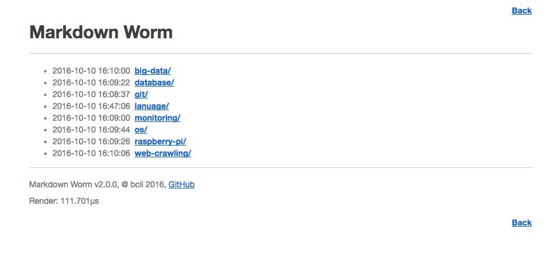

# Markdown Worm #

---

__v2.0.0__

GoLang Markdown viewer, based on [golang-commonmark/markdown](https://github.com/golang-commonmark/markdown), 
[Mou](http://25.io/mou/), and [HighlightJS](https://highlightjs.org/)

[中文版说明](README_CN.md)

## What is Markdown ?

Markdown is a lightweight markup language with plain text formatting syntax designed so that it can be converted to HTML and many other formats using a tool by the same name. Markdown is often used to format readme files, for writing messages in online discussion forums, and to create rich text using a plain text editor.

## Share your Markdown ~~Like a Man~~ LIKE A BOSS

Markdown Worm act as a simple markdown file server.
Useful on storing & sharing Markdown notes & documents. Especially on a local network with
you colleagues (I'm doing this right now) 

## Changes since v1.0.1

1. Completely replaced PHP by GoLang, plus you won't need GoLang to run __release tar balls__
2. You can now add directory under folder __md__
3. There's __no windows binary release__ this time since I don't use windows (a big virus) :3

## Showcase
###1. Generated Markdown File List

###2. Markdown will be converted to html by [golang-commonmark/markdown](https://github.com/golang-commonmark/markdown)

###3. Code syntax will be auto-detected and highlighted by [Highlight.js](https://highlightjs.org/)

## Notice

`golang-commonmark` has a weird feature, which __requires__ you to add a space between
title text and hash tags, for example `#title#` won't be parsed correctly, but
`# title #` will work fine

## Install

### Mac & Linux

1. Download & Unzip

    cd /to/dir/
    # For Mac
    wget https://github.com/bclicn/MarkdownWorm/releases/download/v2.0.0/mdworm-2.0.0-darwin.tar.gz
    tar zxvf mdworm-2.0.0-darwin.tar.gz
    
    # For Linux
    wget https://github.com/bclicn/MarkdownWorm/releases/download/v2.0.0/mdworm-2.0.0-linux.tar.gz
    tar zxvf mdworm-2.0.0-linux.tar.gz
    
    
2. Run
    
   cd mdworm-2.0.0-*
   ./mdworm
   
3. Open your browser and type `localhost:2333`

## Arguments

You can use `-p` to change the default port (`2333`), `-t` to change default code theme (`./public/css/themes/default.css`).
A full list of code theme can be found under `./public/css/themes/`, here are argument examples:

    # listen on port 6666
    ./mdworm -p 6666
    # change default theme to darcula
    ./mdworm -t darcula
    # listen on port 6666 & change default theme to darcula
    ./mdworm -p 6666 -t darcula

## Github is a lonely place

Well, it looks like __I AM JUST RELEASING
TARBALLS TO MYSELF!!!!__. For god sake no matter what you think of my code, just leave 
a comment under the issues tab. I just want to know if there's still somebody alive
on this website, thanks.

## MIT License

===
Beichen Li 2016-10-24
